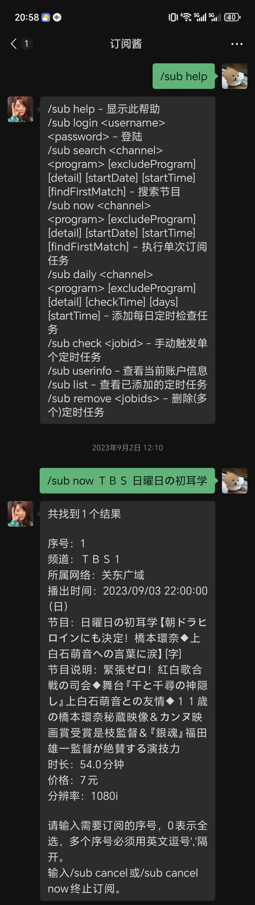
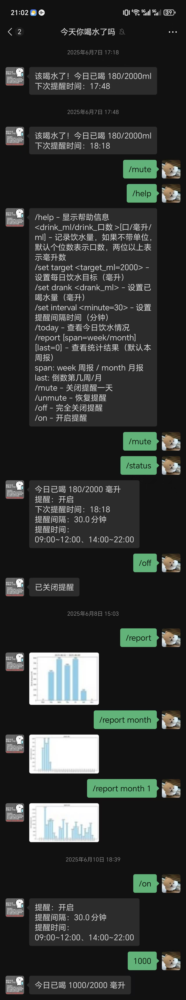
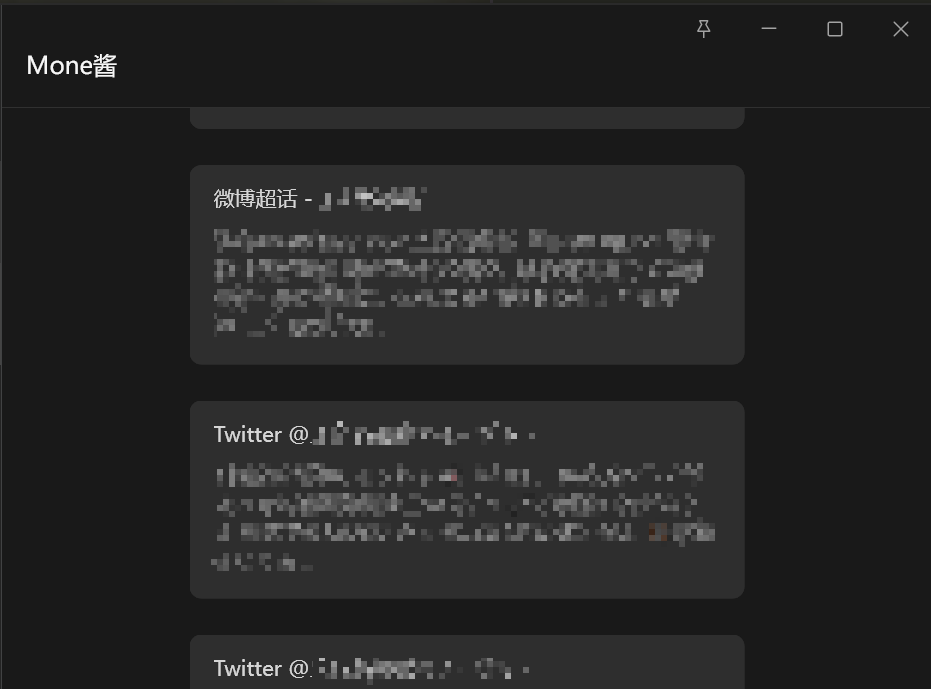
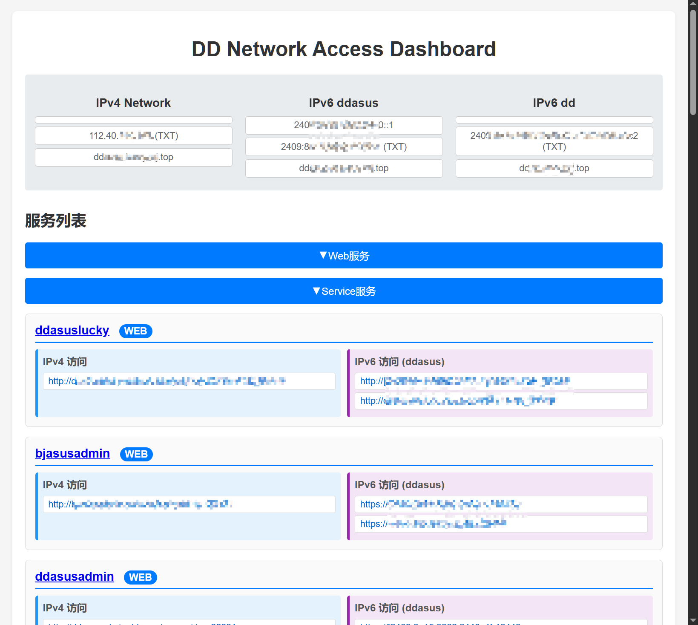

# myflaskserver

`myflaskserver` is a Flask-based personal gateway service. Some useful modules are designed in `wecom_responder/routes`. It is mainly used as a endpoint for responding my WeCom bot messages, with some other features like a small DDNS-style redirect dashboard, and exposing webhook endpoints.

## Project layout

- `wecom_responder/app.py` creates the Flask app and registers all enabled
  blueprints.
- `wecom_responder/routes/` contains featured modules.
- `wecom_responder/config.json` is the live runtime configuration.
- `wecom_responder/config_template.json` documents the expected main config
  shape.
- `wecom_responder/config_ddredirect.json` stores the mutable DD redirect
  service/IP/port configuration.
- `requirements.txt` lists the Python dependencies.

## Running

Install dependencies, prepare `wecom_responder/config.json` from
`config_template.json`, then run:

```bash
python3 -m wecom_responder.app
```

The default template uses:

- `APP_HOST`: `0.0.0.0`
- `APP_HOST6`: `::`
- `APP_PORT`: `23222`
- `DUMBBOT_HOST`: `127.0.0.1`
- `SUBBOT_PORT`: `18888`
- `DRINKBOT_PORT`: `18889`

## Route loading

At startup, `BpLoader` scans `wecom_responder/routes/*/*.py`, imports modules
whose filename matches the route directory name, and registers every Flask
`Blueprint` object found in that module if `enabled_modules.<module_name>` is
true in `config.json`.

For example, `routes/webhook/webhook.py` is imported as
`wecom_responder.routes.webhook.webhook`.


## Routes / Modules

### Root routes

#### `GET /test`

Health-check style endpoint. Returns the plain text response:

```text
Welcome to wecom_responder!
```

#### `GET /`

Blocked to prevent exposure of the service.

### Subscribe channel routes

The `subscribe_chan` module bridges incoming WeCom messages to a local text bot [TVSubscriberBot](https://github.com/zhimengsub/TVSubscribeBot) in `subbot.py`
and sends bot results back to WeCom. The `TVSubscriberBot` queries and subscribe tv programs. It interactively ask for tv information like channel name and program title, and supports scheduled queries.

It creates a `WecomReceiver` with URL prefix:

```text
/subscribe_chan_recv
```

`WecomReceiver` itself registers the callback endpoints used by WeCom for URL
verification and message delivery.

#### `POST /subscribe_chan_send/<touid>`

Sends a processed text result back to a WeCom user.

Expected JSON body:

```json
{
  "result": "message text"
}
```

Behavior:

- Reads `result` from the JSON body.
- Sends it to `touid` through `WecomSan.send_autosplit`.
- Splits content according to `MAX_RESPONSE_BYTES`.
- Returns `OK` when a non-empty result is submitted.

Incoming text messages received by `/subscribe_chan_recv` are converted into
local `User`/`Chat` objects and submitted to `TextSubmitter` at
`DUMBBOT_HOST:SUBBOT_PORT`.

Demo image:


### Drink channel routes

The `drink_chan` module has the same bridge pattern as `subscribe_chan`, using
the drink bot port instead. The bot defined in `drinkbot.py` records daily drink intake and provides statistics like weekly/monthly intake charts. It also supports interactive queries and scheduled reminders.

It creates a `WecomReceiver` with URL prefix:

```text
/drink_chan_recv
```

Incoming text messages are submitted to `TextSubmitter` at
`DUMBBOT_HOST:DRINKBOT_PORT`.

#### `POST /drink_chan_send/<touid>`

Sends a processed text result back to a WeCom user.

Expected JSON body:

```json
{
  "result": "message text"
}
```

Behavior:

- Reads `result` from the JSON body.
- Sends it to `touid` through `WecomSan.send_autosplit`.
- Splits content according to `MAX_RESPONSE_BYTES`.
- Returns `OK` when a non-empty result is submitted.

#### `POST /drink_chan_send/image/<touid>`

Sends an image result back to a WeCom user.

Expected JSON body:

```json
{
  "result": "image media id or image payload accepted by WecomSan"
}
```

Behavior:

- Reads `result` from the JSON body.
- Sends it to `touid` through `WecomSan.send_image`.
- Returns `OK` when a non-empty result is submitted.

Demo image:


### Webhook routes

#### `GET|POST /webhook/freshrss`

Receives a FreshRSS-style JSON payload and forwards it to a WeCom bot ([FreshrssCrawler](https://github.com/barryZZJ/freshrsscrawler)) as a
text-card message. Used for periodically sending RSS feed updates collected by my FreshRSS service to WeCom.

Expected fields used by the implementation:

```json
{
  "title": "item title",
  "feed": "feed title",
  "url": "original item URL",
  "created": "timestamp",
  "content": "item content",
  "thumbnail_url": "thumbnail URL"
}
```

Behavior:

- Uses `feed` as the text-card title.
- Uses `myflaskServer Webhook:<title>` as the description.
- Uses `url` as the card link.
- Sends through `conf['bots']['mone_chan']`.

Demo image:


### WeCom temporary media routes

These routes proxy temporary WeCom media by first creating a `WecomSan` client
and using its access token to call the WeCom media API.

#### `GET /wecom_temp_media/file/<media_id>`

Streams raw temporary media from:

```text
https://qyapi.weixin.qq.com/cgi-bin/media/get
```

Behavior:

- Passes `access_token` and `media_id` to the WeCom API.
- Streams the upstream response body.
- Copies upstream headers except `content-length`, `connection`, and
  `content-encoding`.

#### `GET /wecom_temp_media/<media_id>`

Fetches temporary media as HTML, optionally modifies one redirect link, and
returns `text/html; charset=utf-8`.

Behavior:

- Downloads the media content from WeCom.
- Detects whether the request `User-Agent` contains `MicroMessenger`.
- If the HTML contains a matching redirect link to `tvkingdom` and the client
  is WeChat, replaces that link with a JavaScript alert asking the user to open
  it in a browser.
- Returns the modified HTML.

### DD redirect routes

The `ddredirect` module provides an authenticated dashboard. It is used as a fixed endpoint for redirecting to my home services which are behind dynamic ports (due to STUN NAT piercing). 

Information like dynamic IP/port data are stored in `config_ddredirect.json` and can be automatically updated via a webhook as the ports change.

Dashboard and webhook routes use HTTP Basic Auth from:

```text
config_ddredirect.json -> auth.username / auth.password
```

#### `GET /dd/`

Authenticated dashboard page.

Behavior:

- Loads `config_ddredirect.json`.
- Resolves configured TXT records to discover current DNS-published IPs.
- Renders `routes/ddredirect/templates/dashboard.html`.
- Shows configured services, IPs, STUN ports, DNS TXT results, and timestamp.

#### `GET /dd/<service_name>`

#### `GET /dd/<service_name>/<path:req_path>`

Public IPv4 service endpoint.

Behavior:

- Looks up `service_name` in `config['services']`.
- Uses `config['ips']['ipv4']`.
- For `web` services:
  - Uses the `ddasus_web` STUN port.
  - Builds a URL from service scheme, subdomain, domain, configured path, the
    requested trailing path, and query string.
  - Redirects the client to that URL.
- For non-web services:
  - Uses the STUN port named after the service.
  - Returns plain text containing `ip:port` and `domain:port`.

#### `GET /dd/6/`

Authenticated IPv6 dashboard shortcut. Redirects to `/dd/`.

#### `GET /dd/6/<service_name>`

Public IPv6 service endpoint.

Behavior:

- Looks up `service_name` in `config['services']`.
- Requires the service to define `ipv6_host` and `original_port`.
- Selects the configured IPv6 host IP/domain.
- Resolves DNS TXT records and compares the TXT IP with the configured current
  IP.
- For `web` services:
  - Redirects to a domain URL when TXT and configured IP match.
  - Otherwise redirects to a bracketed IPv6 literal URL.
  - Preserves query string.
- For non-web services:
  - Returns plain text with the preferred address on the first line and a
    fallback address on the second line.

#### `POST /dd/webhook/update_ip/<ip_type>`

Authenticated webhook for updating an IP entry in `config_ddredirect.json`.

Expected JSON body:

```json
{
  "ip": "new IP address"
}
```

Behavior:

- Validates that `ip` is present.
- Validates that `ip_type` exists in `config['ips']`.
- Updates `config['ips'][ip_type]`.
- Saves `config_ddredirect.json`.
- Returns JSON success or error messages.

#### `POST /dd/webhook/update_stun_port`

Authenticated webhook for updating a STUN port and the current IPv4 address.

Expected JSON body:

```json
{
  "service_name": "service key",
  "port": 12345,
  "ip": "new IPv4 address"
}
```

Behavior:

- Validates `service_name`, `port`, and `ip`.
- Updates `config['stun_ports'][service_name]`.
- Updates `config['ips']['ipv4']`.
- Saves `config_ddredirect.json`.
- Returns JSON success or error messages.

Demo image:


### Generic remote proxy

#### `GET|POST /redirect/<path:url>`

Proxies the incoming request to the full target URL supplied in the path.

Behavior:

- Copies request headers except `Host`.
- Replaces `User-Agent` with a Firefox-like desktop user agent.
- Forwards query parameters and raw request body.
- Copies upstream response headers and status code back to the client.
- Returns `500` with the request exception text on upstream request failure.

Example shape:

```text
/redirect/https://example.com/path
```


### WeCom verification

#### `GET /verify/WW_verify_Ua7WxLfBndo8F2SR.txt`

Returns the WeCom verification token:

```text
Ua7WxLfBndo8F2SR
```

### WireGuard route

#### `GET /wireguard/`

Returns the URL path generated for the local WireGuard proxy route:

```text
/redirectlocal/wireguard/
```

In the automatically loaded `wireguard.py` module this endpoint returns the URL
as text. The sibling `wireguard_chan.py` module contains a redirecting variant
and WeCom command handling for WireGuard service control, but it is not
registered by the current auto-loader.

## Configuration notes

Main module enablement is controlled by `enabled_modules` in
`wecom_responder/config.json`. Module-specific secrets and bot credentials live
under `module_params`.

Important module parameter groups:

- `drink_chan`: WeCom receiver token/AES key and bot credentials.
- `subscribe_chan`: WeCom receiver token/AES key and bot credentials.
- `temp_media_redirect`: bot credentials for fetching WeCom temporary media.
- `webhook`: bot credentials for RSS text cards and notification messages.
- `wireguard`: bot credentials plus public WireGuard URL.
- `ddredirect`: dynamic service data is stored separately in
  `config_ddredirect.json`.

Do not commit live `config.json` or `config_ddredirect.json` if they contain
real tokens, secrets, internal IPs, or Basic Auth credentials.
